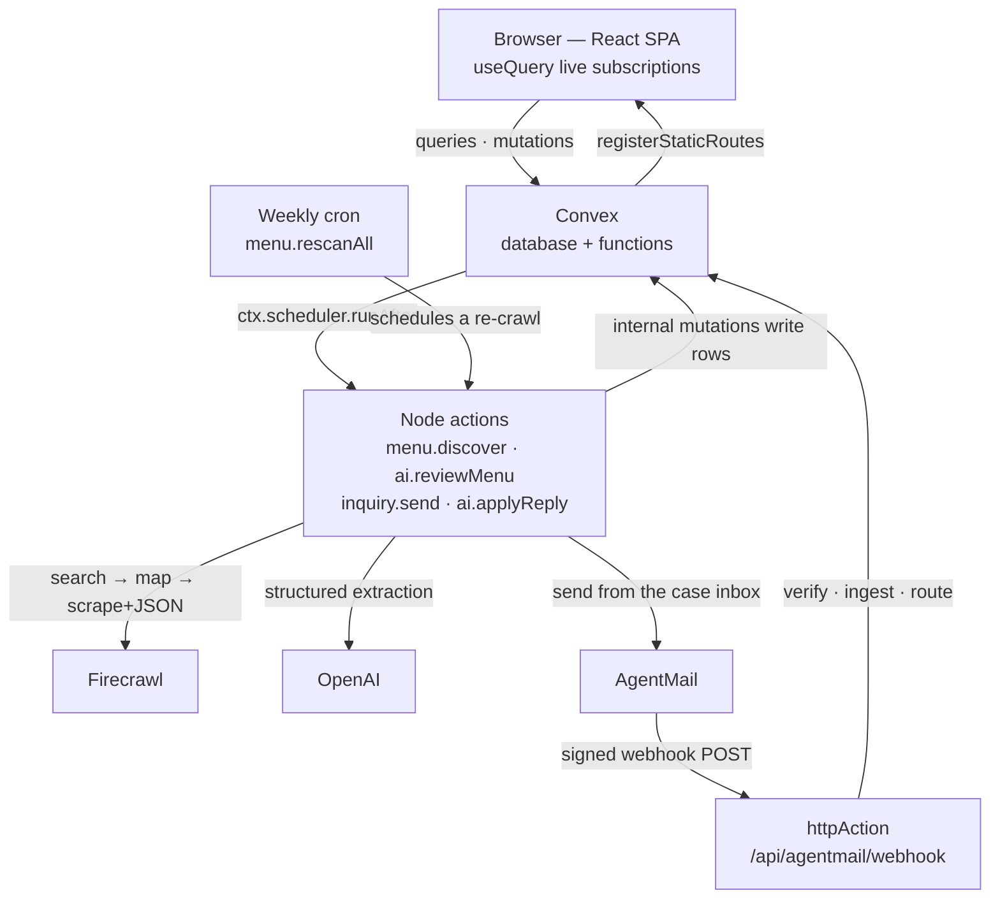
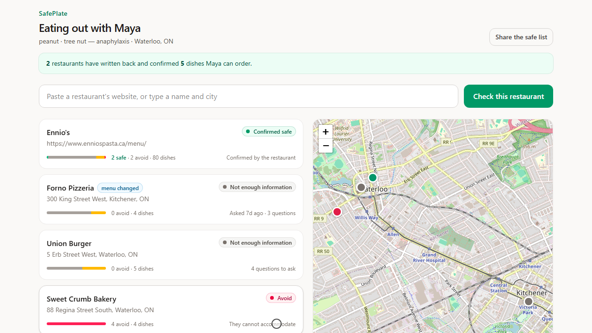
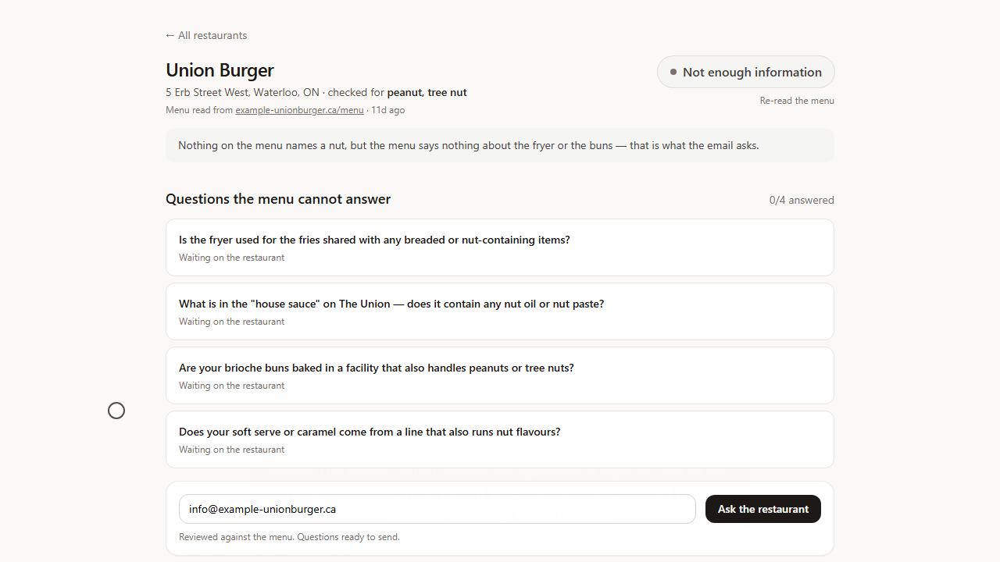
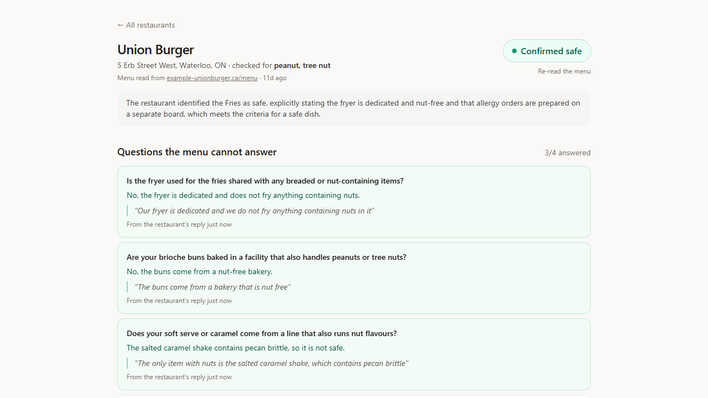
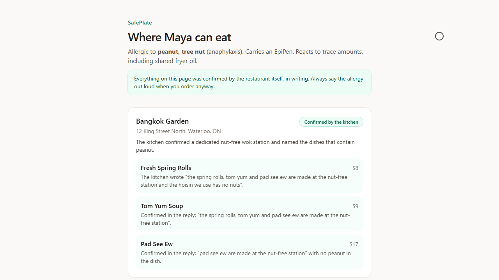

# SafePlate

**Eating out with a serious food allergy, without having to take anyone's word for it.**

🌐 **[Live demo](https://valiant-fox-223.convex.site)** · 🎬 Demo video: `TODO: video link` · 📋 [Build log](hackathon.md)

> The demo runs on free tiers of Convex, OpenAI, Firecrawl and AgentMail, so under load some features may be rate-limited — the video shows the full flow.

## 🍽️ What this is

SafePlate is for the parent of a child who could go into anaphylaxis from a trace of peanut. You paste a restaurant's website — or just its name and city — and SafePlate finds the real menu, reads every dish against your child's allergy profile, and tells you which dishes are dangerous, which are questionable, and what the menu simply does not say.

Then it does the part nobody has time for: it emails the restaurant the handful of questions a menu can never answer, reads the reply, and turns the kitchen's own sentences into answers you can see. Restaurants that write back with something real end up on a printable page you can send to a grandparent or a babysitter.

It is deliberately not an oracle. SafePlate never decides a dish is safe by itself.

## 😰 The problem

If your child has an anaphylactic allergy, every restaurant is a small risk assessment done under time pressure. Menus rarely list allergens properly — a description says "house sauce" and not "contains peanut oil", and it says nothing at all about whether the fries share a fryer with the breaded shrimp, or whether the buns come from a bakery that also runs nut lines. So you phone ahead, and you hope that whoever picks up is the person who actually knows what happens on the fryer line, and that they understood the question. Most families do this every single time, and most of the time they end up going somewhere they have already been.

## ✅ Our solution

1. **Set up a profile.** A first name, the allergens, and how serious it is — "Maya, peanut + tree nut, anaphylaxis". Anonymous sign-in means there is no login wall; a judge can also press **open the demo family** and get their own working copy of a fully populated account.
2. **Add a restaurant.** Paste a URL, or type "Union Burger, Waterloo". Firecrawl finds the site, finds the menu page and pulls the dishes off it.
3. **Read the verdicts.** Every dish gets one of *avoid*, *risky* or *not enough information*, each with a one-line reason that quotes the words on the menu that produced it, and a line saying whether the source was the menu text or the restaurant's reply. The restaurant page also links to the exact page the menu came from and keeps an excerpt of what was actually read.
4. **See it on a map.** Pins are coloured by verdict and update live as the pipeline runs.
5. **Ask the restaurant.** SafePlate writes a short, friendly email containing the specific questions the menu left open — shared fryers, sauces, "may contain" labelling — and sends it from an AgentMail inbox with a routing code in the subject.
6. **Watch the reply land.** When the kitchen replies, the questions fill in with the answer *and* the verbatim sentence it came from, dishes are re-judged, and the pin can finally turn green.
7. **Share the safe list.** `/s/:slug` is a public, sign-in-free, printable page listing only restaurants that confirmed by email and only the dishes they confirmed. It is the page you hand to whoever is feeding your child when you are not there.

## 🧰 How we used each sponsor

| Sponsor | What it does in SafePlate | Where in the code |
|---|---|---|
| **Convex** | The whole application: database, queries/mutations/actions, live updates, auth, HTTP routes, scheduler, cron, rate limiting, and static hosting of the frontend | all of `convex/`, plus `src/` |
| **OpenAI** | Judges every dish against the profile, writes the questions and the email, and reads the restaurant's reply back into structured state | `convex/lib/llm.ts`, `convex/ai.ts`, `convex/inquiry.ts` |
| **Firecrawl** | Finds the restaurant, finds the menu page, and extracts the dishes as structured JSON | `convex/lib/firecrawl.ts`, `convex/menu.ts` |
| **AgentMail** | Sends the enquiry from a real inbox and receives the restaurant's reply through a signed webhook | `convex/lib/agentmail.ts`, `convex/mailActions.ts`, `convex/http.ts` |

### Convex

Convex is not the backend behind this app; it *is* the app.

- **Schema and indexes** — `convex/schema.ts` defines `profiles`, `restaurants`, `dishes`, `questions`, `mailMessages`, `senderRoutes`, `settings`, `usage`, `crawlCache` and `crawlBudget`, on top of `authTables`. Every read path has an index: `by_profile`, `by_profile_status`, `by_restaurant`, `by_restaurant_verdict`, `by_slug`, `by_caseCode`, `by_messageId`, `by_threadId`, `by_target`, `by_routed`, `by_day_provider`, `by_key`.
- **Queries, mutations, actions** — `restaurants.listForProfile` and `restaurants.detail` are single live subscriptions that fan out dishes, questions and the email thread. Mutations (`restaurants.add`, `restaurants.ask`, `restaurants.rescan`, `profiles.create`) stay fast because they only write a row and schedule work. Node-runtime actions (`menu.discover`, `ai.reviewMenu`, `ai.applyReply`, `inquiry.send`, `mailActions.send`) hold every SDK call, so no API key ever reaches the browser.
- **Live updates** — the dashboard is `useQuery` all the way down. A restaurant added seconds ago streams its own progress line ("Looking for the menu page…", "Found 41 dishes…") because the action patches the row as it goes. `Dashboard.tsx` also uses `withOptimisticUpdate` so the new card appears before the server round-trip.
- **HTTP actions** — `convex/http.ts` runs one router: Convex Auth's `/api/auth/*` routes, an exact route at `/api/agentmail/webhook`, and `registerStaticRoutes` registered last as the catch-all that serves the SPA.
- **Scheduler** — `ctx.scheduler.runAfter` is the seam between the request path and the expensive path. `restaurants.add` → `menu.discover` → `ai.reviewMenu`; `restaurants.ask` → `inquiry.send`; and crucially `mail.ingest` → `inbound.onInbound`, so the webhook returns 200 in milliseconds and a slow model can never cause a retry storm.
- **Cron** — `convex/crons.ts` runs `menu.rescanAll` every Monday at 06:00 UTC. Menus change; a dish the kitchen confirmed in March may be cooked in a shared fryer by June. If the dish list hash changed, the review re-runs and the card raises a "menu changed" badge instead of leaving a stale green pin a parent would trust.
- **Convex Auth** — `convex/auth.ts` registers `Anonymous` and `Password`. Anonymous is the primary path (`src/auth.tsx` signs you in on load) so nobody hits a login wall; Password exists so a real family can come back to their data. Ownership is enforced in every function via `getAuthUserId`.
- **Components** — `convex/convex.config.ts` registers three. `@convex-dev/static-hosting` serves this frontend at the live URL and exposes `staticHosting.getCurrentDeployment`. `@convex-dev/rate-limiter` backs `convex/lib/limits.ts`, where every credit-spending action is limited twice — once per user, once globally for the whole deployment — so a burst of judging traffic cannot exhaust a free tier. `@convex-dev/agent` is registered on the chassis but no product path in this app uses it.
- **Public unauthenticated query** — `profiles.publicSafeList` takes only a slug, does no auth check, and is deliberately narrow: it returns restaurants with status `confirmed` and, within them, only dishes whose verdict is `safe` **and** whose evidence is `reply`. The slug (`profiles.slug`, `by_slug`) is a name plus ten random characters, so the page is shareable without being guessable, and `src/App.tsx` routes `/s/:slug` outside the auth wrapper entirely.
- **Honest state instead of spinners** — `crawlCache.status` is a public query returning a boolean, never the raw credit balance, so the UI can say "Showing saved menu data" rather than looking broken. `usage.today` and `mail.unrouted` back an `/admin` screen showing today's spend per provider and any email that could not be routed; `mail.unrouted` is readable only by an account with an email address, because anonymous sign-in proves nothing about who is asking.
- **A demo that costs nothing** — `seed.copyDemo` is a mutation that clones a template family into the visitor's own account with fresh ids, a fresh public slug and fresh email codes, skipping any row still mid-pipeline. The app is fully interactive on first load without spending a single crawl credit.

### OpenAI

OpenAI does three separate jobs, all through `convex/lib/llm.ts` — the one module allowed to call a model.

- **`ai.reviewMenu`** reads the dishes in chunks of 20 against the profile, returning a verdict and a one-sentence reason per dish, then writes at most five questions the menu cannot answer plus a summary line. Every response is structured: the zod schema is converted to JSON Schema, sent with the request, and parsed and validated on the way back (`llm.extract`).
- **`ai.applyReply`** reads the restaurant's email and returns matched answers with a **verbatim quote**, dish-level updates, and a restaurant verdict. It is instructed to leave a question out entirely rather than answer it from outside knowledge.
- **`inquiry.send`** drafts the actual email a parent would send, with the generated questions kept verbatim and numbered. If that call fails, a hand-written fallback goes out instead — the questions are the point, not the prose.
- OpenAI is also the fallback menu parser in `menu.discover` when a page's structured extraction comes back empty.
- Extraction runs at temperature 0 and asks for a JSON object; if a response ever fails schema validation the call is retried once and, failing that, the restaurant lands in a visible error state rather than a fabricated verdict. Nothing that failed to validate is ever written to a row.

### Firecrawl

Firecrawl does the finding, not just the fetching. `menu.discover` runs a three-step chain:

1. **`search`** — given "Union Burger, Waterloo" rather than a URL, Firecrawl's search finds the restaurant's actual website.
2. **`map`** — enumerate the site's URLs and rank them for menu-ness (`looksLikeMenu` scores `/menu`, allergen and nutrition pages up, careers and gift-card pages down).
3. **`scrape` with structured extraction** — the winning page is scraped with a JSON schema and prompt in the same call, so a menu page comes back as dish rows (name, description, price, section, ingredients) plus the restaurant's address and contact email, not markdown we have to re-parse.

Every one of those calls goes through a single gateway in `convex/lib/firecrawl.ts` that checks a **stored copy first**, then checks affordability against Firecrawl's own credit-usage endpoint before spending. Results are cached in the `crawlCache` table and the budget is denominated in **credits**, not calls — because Firecrawl bills in credits, and a JSON-extraction scrape is budgeted at five times a plain one. Crucially, it is the *extracted JSON* that is cached, not just the page text: the second judge to try the same restaurant costs nothing, and when the crawl budget is spent the app still has its dish rows and says so in plain words ("Showing saved menu data") instead of breaking. A restaurant that could not be crawled at all lands in a retryable `paused` state and is never given a verdict.

### AgentMail

- **One inbox, created once.** `mailActions.ensureInbox` looks up an inbox by `clientId` before creating one, so re-running never burns a free-tier inbox. The live deployment writes from `clearchoice455@agentmail.to`.
- **Sending.** `inquiry.send` → `mailActions.send` → `lib/agentmail.sendMail`. The subject carries a per-restaurant routing code, e.g. `[SP-7F3K]`. Sending fails closed: without `DEMO_RECIPIENT_OVERRIDE` or an explicit `ALLOW_REAL_SENDS=1`, the app refuses to email a real business, and the drafted enquiry is stored and shown in the thread marked "not sent" rather than being lost.
- **Receiving.** AgentMail posts to `/api/agentmail/webhook`. The signature is verified with HMAC-SHA256 over `id.timestamp.body` using Web Crypto (`convex/lib/svix.ts`) so it runs in Convex's default runtime, with a five-minute timestamp tolerance and a timing-safe compare. Unsigned or stale requests get a 401.
- **Routing.** `mail.ingest` is idempotent on `messageId` (webhooks retry) and routes in three tiers: thread id, then the `[SP-XXXX]` code in the subject matched against the *normalised subject* of the enquiry we actually sent, then a registered sender address. Anything unroutable is kept and surfaced on `/admin` — never silently dropped. Delivery and bounce events update `deliveryStatus`.

## ⚙️ How it works



The core loop, function by function:

1. `restaurants.add` (mutation) inserts the row with status `scraping` and schedules `menu.discover`.
2. `menu.discover` (Node action) runs Firecrawl `search` → `map` → `scrapeJson`, normalises the messy result (`normalizeMenu`), writes dishes through `restaurants.replaceDishes` — **every dish starts `unclear`** — geocodes the address for a pin, hashes the dish list, and schedules `ai.reviewMenu`.
3. `ai.reviewMenu` (Node action) asks OpenAI for a verdict per dish plus the open questions, and calls `restaurants.saveReview`.
4. `restaurants.saveReview` (mutation) writes the verdicts, **downgrading any `safe` to `unclear`**, and stores the questions. The dashboard is already re-rendering.
5. `restaurants.ask` (mutation) schedules `inquiry.send`, which drafts the email and sends it through `mailActions.send` with the case code in the subject.
6. AgentMail delivers the reply to `/api/agentmail/webhook`; `verifySvix` checks the signature and `mail.ingest` stores and routes it, then schedules `inbound.onInbound`.
7. `inbound.onInbound` resolves any still-unrouted message by case code and calls `ai.applyReply`, which asks OpenAI to match the reply to our questions with verbatim quotes.
8. `restaurants.applyReplyResult` (mutation) writes the answers, re-verdicts the dishes with `evidence: "reply"`, and sets the restaurant status — refusing to say `confirmed` unless at least one dish was actually vouched for.
9. `profiles.publicSafeList` now returns that restaurant on the shared caregiver page.
10. Every Monday, `menu.rescanAll` (cron) picks up to five restaurants whose menu has not been read in a week and re-schedules `menu.discover` for each, closing the loop: a changed menu re-runs the review and flags the card rather than leaving a confirmation standing.

## 🛟 The safety rules

This is the most deliberate engineering decision in the app, and it is enforced in code rather than left to a prompt.

- **A menu can never make a dish safe.** The review prompt forbids the verdict `safe`, and `restaurants.saveReview` downgrades a `safe` to `unclear` anyway, appending *"Still needs the kitchen to confirm how it is prepared."* A menu line can prove danger ("satay, peanut sauce"); it says nothing about the fryer, the prep surface or the supplier.
- **Only the kitchen can promote a dish to safe.** The single path that may write `verdict: "safe"` is `restaurants.applyReplyResult`, reached only from a verified inbound email. Those dishes are stamped `evidence: "reply"` and `updatedFromReply: true`, and a later menu re-scan will not overwrite them. A restaurant only reaches `confirmed` if at least one dish was confirmed; an out-of-office is classified `auto_reply` and moves nothing.
- **Every verdict shows its reason and its source.** Each dish line carries a one-sentence reason quoting the menu text or the reply, and a label reading either "Source: the menu text" or "Source: the restaurant's emailed reply". The restaurant page links the exact URL the menu was read from and keeps an excerpt of it.
- **The restaurant's own words are quoted back.** Answered questions render the verbatim sentence from the reply in a blockquote, so you can judge the kitchen's answer yourself instead of trusting a paraphrase.
- **A stale confirmation is flagged, not trusted.** The weekly cron hashes the dish list; if it changed, the review runs again and the card carries a "menu changed" badge warning that anything the kitchen confirmed before may no longer apply. And when the crawl budget refuses a re-scan, the row is put back exactly as it was — a `paused` row keeps its old status and never gains a verdict, so nothing silently drops off, and nothing silently turns green.
- **The caregiver page is confirmed-only.** `profiles.publicSafeList` filters to `status === "confirmed"`, `verdict === "safe"` and `evidence === "reply"`, then drops any restaurant left with no reply-backed dishes. Nothing amber ever reaches the fridge door.
- **Not medical advice.** Said on every screen, not buried in a tooltip: *"SafePlate helps you ask better questions. It is not medical advice, and it cannot see inside a kitchen… always tell staff about the allergy when you order."* Menus and suppliers change — this app makes the risk assessment better informed, not safe.

## 📸 Screenshots


*Live verdicts per restaurant, with pins coloured by verdict. Two restaurants have written back; a third is flagged because its menu changed since the last check.*


*The menu named no nut, so the verdict stays "Not enough information" — and these are the questions that get emailed to the kitchen.*


*The strongest screen in the app: each question answered, with the restaurant's own sentence quoted underneath it. Only this — a real reply — can turn a restaurant green.*


*The public, sign-in-free, printable page at `/s/:slug`: only restaurants that confirmed in writing, only the dishes they confirmed, each with the sentence that confirmed it.*

## 🚀 Running it yourself

```bash
pnpm install
npx convex dev      # backend, in one terminal
pnpm dev            # vite dev server, in another
pnpm run build      # tsc -b && vite build
pnpm run deploy     # publish dist/ through @convex-dev/static-hosting
```

Set these on the Convex deployment with `npx convex env set NAME VALUE` — names only, values never live in the repo:

`JWT_PRIVATE_KEY`, `JWKS`, `SITE_URL` (Convex Auth) · `LLM_BASE_URL`, `LLM_API_KEY`, `LLM_MODEL` · `FIRECRAWL_API_KEY`, and optionally `FIRECRAWL_MIN_CREDITS`, `FIRECRAWL_DAILY_CREDITS`, `FIRECRAWL_CACHE_TTL_HOURS` · `AGENTMAIL_API_KEY`, `AGENTMAIL_WEBHOOK_SECRET` · `DEMO_RECIPIENT_OVERRIDE` (redirects all outbound mail in development) · `ALLOW_REAL_SENDS=1` (production only, deliberate) · `APP_PAUSED=1` (kill switch for every credit-spending action).

See `.env.example` for the full list. Point your AgentMail webhook at `https://<your-deployment>.convex.site/api/agentmail/webhook` and give it the same secret as `AGENTMAIL_WEBHOOK_SECRET`; without it the app still drafts enquiries and shows them in the thread, marked "not sent".

## 🙏 Credits

Built for the **Convex All Gas Hackathon**, sponsored by **OpenAI**, **Firecrawl** and **AgentMail**.

Convex for the database, functions, auth, scheduler, cron, components and hosting · OpenAI for the judgement and the language · Firecrawl for search, mapping and structured menu extraction · AgentMail for the inbox that actually talks to restaurants. Map tiles from OpenStreetMap via Leaflet; geocoding via Nominatim.

For every family who reads a menu twice.
